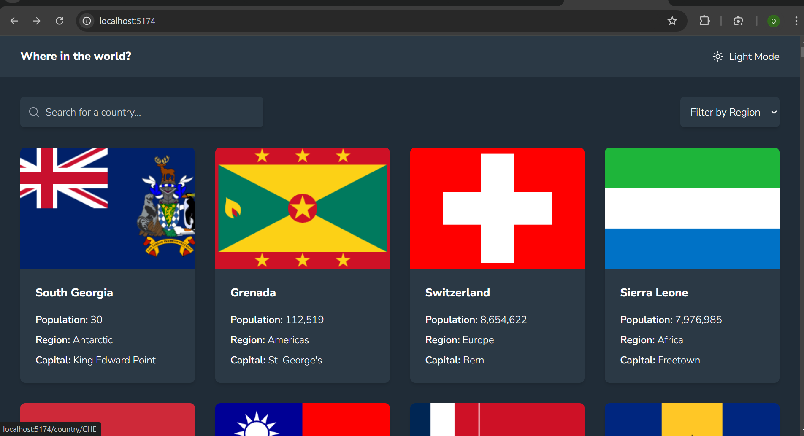
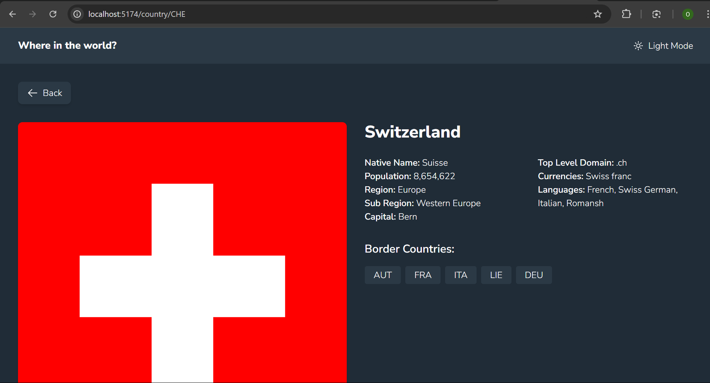
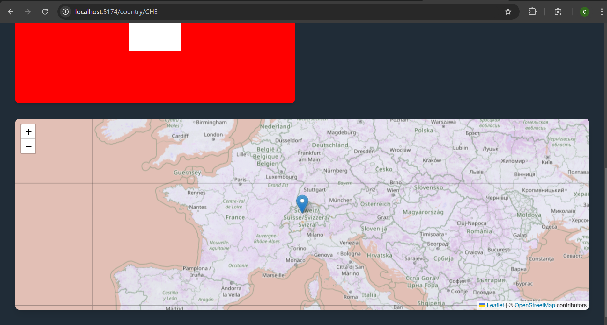
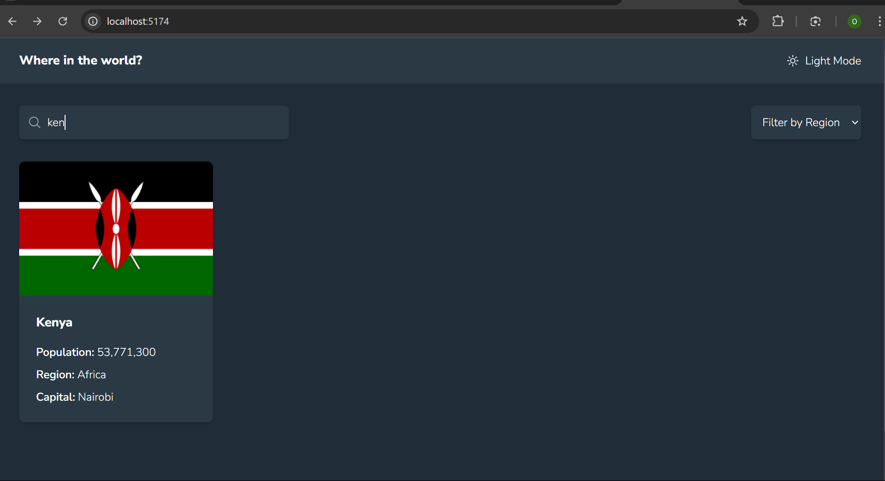

# Where in the world?
## Countries App with Theme Switcher

A web application that integrates with the REST Countries API to display country information with a theme switcher feature.






## Features

- View all countries from the API on the homepage
- Search for a country using an input field

- Filter countries by region
- Click on a country to see more detailed information on a separate page
- Toggle between light and dark mode
- Interactive map showing country location

- Responsive design that works on desktop and mobile
- Click through to border countries on the detail page

## Technologies Used

- React
- React Router for navigation
- Tailwind CSS for styling
- Axios for API requests
- React Leaflet for interactive maps
- Hero Icons for icons
- Dark mode implementation
- REST Countries API

## Project Structure

- `src/components/`
  - `CountryCard.jsx` - Card component for displaying country preview
  - `CountryMap.jsx` - Interactive map component using React Leaflet
- `src/pages/`
  - `CountryInfo.jsx` - Detailed country information page
- `tailwind.config.js` - Tailwind CSS configuration including dark mode
- `index.html` - Entry point with required CDN links

## Setup and Installation

1. Clone the repository
2. Install dependencies:
   ```bash
   npm install
   ```
3. Run the development server:
   ```bash
   npm run dev
   ```

## API Reference

This project uses the [REST Countries API](https://restcountries.com/) to fetch country data.
The following endpoints are used:

- `GET https://restcountries.com/v3.1/all` - Get all countries
- `GET https://restcountries.com/v3.1/alpha/{code}` - Get country by code
- `GET https://restcountries.com/v3.1/name/{name}` - Search countries by name
- `GET https://restcountries.com/v3.1/region/{region}` - Filter countries by region

## Contributing

Contributions are welcome! Feel free to open issues and submit pull requests.

1. Fork the repository
   ```bash
   https://github.com/onesmuskipchumba0/where-in-the-world
   ```

2. Create your feature branch
   ```bash 
   git checkout -b feature/AmazingFeature
   ```

3. Commit your changes
   ```bash
   git commit -m 'Add some AmazingFeature'
   ```

4. Push to the branch
   ```bash
   git push origin feature/AmazingFeature
   ```

5. Open a Pull Request

Please make sure to update tests as appropriate and follow the existing code style.

For major changes, please open an issue first to discuss what you would like to change.


## Design Features

- Custom color scheme for light and dark modes
- Smooth transitions between themes
- Interactive hover effects on cards and buttons
- Responsive grid layout
- Custom map styling with dark mode support
- Accessible navigation with clear visual hierarchy

## Performance Considerations

- Optimized images using appropriate formats
- Lazy loading of country data
- Efficient state management
- Responsive images for different screen sizes
- Smooth animations and transitions

## Future Enhancements

- Add more detailed country statistics
- Implement country comparison feature
- Add more interactive map features
- Include historical data visualization
- Add favorite countries functionality

## Contributing

Contributions are welcome! Please feel free to submit a Pull Request.

## License

This project is open source and available under the [MIT License](LICENSE).
